# Europe's football top 5 leagues 2023/24 predictor

This european football predictor is a python tool is designed to help users forecast match scores between two teams from the top European leagues. By analyzing their performance over the past five seasons, the tool generates accurate score predictions, offering valuable insights for football enthusiasts.

This project runs in the Code Institue mock terminal on Heroku.

This football predictor is live, to access it [click here.](https://football-score-predictor-a1ed8268ea3d.herokuapp.com/)


# Table of contents 
+ [How to use it](#how-to-use-it)
+ [Project Planning](#project-planning)
+ [Features](#features)
+ [Data Model](#data-model)
+ [Testing](#testing)
+ [Technologies used](#technologies-used)
+ [Deployment](#deployment)
+ [Credits](#credits)

# How to use it

This football predictor utilizes data from the top 5 European leagues spanning from the 2018/19 season to the 2022/23 season.

Upon launching the program, users are welcomed and provided with a concise explanation of its functionalities, as well as the leagues it can evaluate. 

The user has two choices, find out a score by inputing two teams or guess a score between two teams randomly displayed.

## Find out score mode

The program prompts the user to input the home and away teams. Leveraging their past season data and considering the home advantage, it calculates the likely match outcome. Home teams enjoy the "home" advantage, which is factored into the result prediction.

In scenarios where the user inputs a team name that does not precisely match the data spreadsheet, the program incorporates a percentage match feature. It then suggests a team based on this matching percentage and asks for user confirmation before proceeding further. This ensures accurate team selection and enhances the overall user experience.

If the user fails to provide an input with a match larger than 70%, the program will promptly provide feedback indicating that the input team is not part of Europe's top five leagues. Following that, it will request the user to re-enter the team name, ensuring compatibility with the supported leagues for accurate predictions.

## Guess score mode

In this mode, the program scans teams from the five European leagues and randomly selects two for users to guess the score of a match between them. Users must adhere to a specific format when entering scores (two numbers separated by a hyphen). If scores are not input in the correct format, an error message is displayed, prompting users to re-enter the input.

Upon correct input of the score, the program assesses the result based on calculations performed in the "find out score" mode. It then compares this result with the user's input and delivers feedback indicating the accuracy of the guess.

# Project planning

The purpose of the project is to process the data of the past 5 seasons of the european leagues and find out scores. The project features were defined by the following flow chart:


However, the process was break down into 4 stages: 

1. Begin by integrating data for a single league into the datasheet, ensuring the functionality of the "find out score" mode.
2. Once the initial mode is verified, extend the implementation to encompass the remaining four European leagues, while maintaining the effectiveness of the "find out score" mode.
3. Enhance the program by incorporating a team suggestion function, recognizing that football teams often have multiple recognized names.
4. Elevate the program's capabilities by introducing the "guess score" mode. This mode will present users with two randomly selected teams, prompt for precise user input, and subsequently compare the user's input against the calculated outcome. 

The presented flowchart showcases a notable omission, the inclusion of the head-to-head results for incorporation into the score result calculation. To address this, an API connection is recommended for retrieving this dynamic statistic. This approach is favored due to the substantial volume of data involved. While each team competes in 38 league matches annually, additional engagements like regional and international cups further compound the dataset. Leveraging an API streamlines the retrieval process by accessing specialized databases, expediting requests that would otherwise be time-intensive when dealing with static data.

# Features

## Existing features
- Welcome the user to the program
    * Clear display of the capacities and limitations of the program

    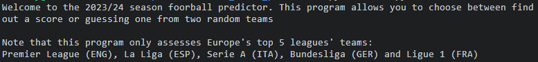

- Ability to choose between two program modes

    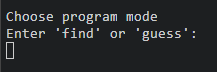

- Find out score
    * When choosing the find out score, the console asks the user which teams they want to check for the score, with some examples:

    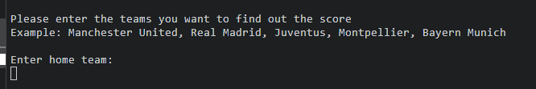

    * After the user inputs an accurate team, the program will provide feedback of which team the user selected and the league this team plays. Then it proceeds to ask the user the away team:

    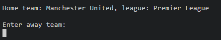

    * If the user inputs a valid team, the program will also display the away team and the league where the team plays. Then it will retrieve the data of both teams using the API connection, perform statistical calculations and provide a result: 

    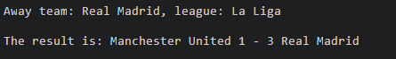

- Guess mode
    * When the guess mode is selected, the program will randomly select two teams from the 5 leagues, and will ask the user to input the score in a specific format:

    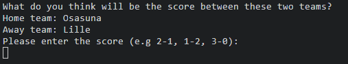

    * If the user inputs a score in the correct format, the program will calculate which will be the score of those two teams using the statistical analysis and will then compare it with the user input. If the user is correct, it will display positive feedback and if the user is incorrect, it will display negative feedback:

    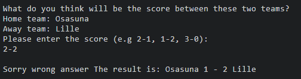

- Restart program
    * After using the find or guess mode, the program will ask the user if they want to use the project again:

    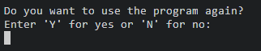

- Team suggestion
    * In football, teams can be known by various names, including nicknames, acronyms, or simplified versions of their official names. For instance: 
        * Machester Untied, Man Untied
        * Bayern Munchen, Bayern Munich
        * FC Barcelona, Barcelona, Barca
    * To address the variation in team names, I utilized the fuzzywuzzy fuzz method. This approach calculates the similarity between two strings, allowing for a more robust and flexible matching process.
    * By combining the fuzzywuzzy method with data_entry_validation(), the program offers the best matching suggestion for the user's input. It then seeks user confirmation to ensure the intended team is accurately identified and considered for further processing.

    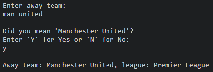

- Input control 
    * The program asks the user multiple inputs in various formats:
        * Select program mode
        * Input teams in find mode
        * Approve team suggestion
        * Input teams score
        * Restart program
    
    For the approval of team suggestion, restart program and selecting program mode, the user is prompted to enter specific inputs based on the desired action. The options include 'y' or 'n' for yes or no, and 'find' or 'guess' for the respective modes. If the user inputs something other than the specified options, the program will show an invalid input message and prompt the user again:

    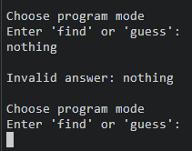

    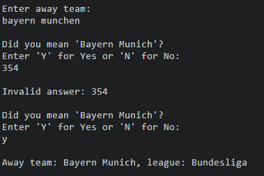

    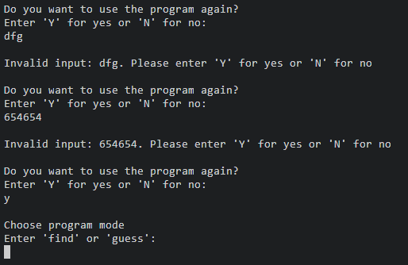

    Upon entering the input teams, the program will initially attempt to propose a team if the user's input bears a 70% similarity to any team within the database. In the event of no matches, the program will offer feedback to the user, indicating that the team either does not belong to the utilized leagues or advising them to review for potential typos or alternate names:

    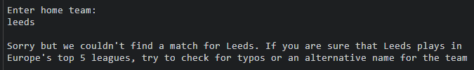

    For the guess mode, the program specifies which type of format the score sholuld be enter to run the program. If the user does not comply, it will display an invalid message and ask for the input again:

    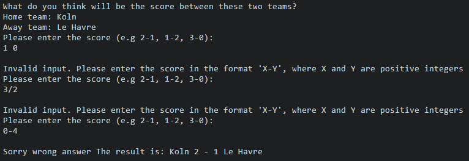

- Closed program feeback. 
    * Once the program executes the chosen mode, whether it's 'find' or 'guess', it will immediately present a query to the user regarding their intention to reuse the program. If the user opts for 'no', the program will express gratitude and distinctly convey that no further operations will proceed.

     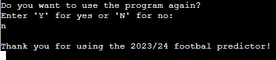

- Data retrival and processing
    * The program scans all 5 worksheets to identify or suggest a match based on user input
    * The program then uses the matches to retrive the specfiic statistics for the teams
    * It the process this data by calculating a weighted average of each team's statistics, which is then multiplied by a factor to determine the result
    * To account for the home advantage, it adds 1 goal for the home team and subtracts 1 goal from the away team.
    * To provide a realistic result, the program sets a maximum goal output of 5 goals.

## Future features

- Use API connection to retrive data from a specific database instead if using static data 
- When using an API connetion, a regression model can be used in conjuction of multiple statistics to arrive to a more accurate result

# Data model
For this project, I employed static data retrieved from [FootyStats](https://footystats.org/). The following statistics were utilized to process and calculate the match result:

- xG (expected goals/match)
- Possession percentage/match
- Shots per match/covertion ratio
- Goals scored/match
- xG against (expected goals conceded/match)
- Goals conceded/match
- Clean sheet percentage

## Data collection and manipulation

The data collection process involved organizing the statistics for each team into specific worksheets. The spreadsheet comprises 5 worksheets, each representing one of Europe's top 5 leagues.

It is important to note that European football leagues operate on a relegation/promotion basis. This means that teams ending a season in the bottom part of the table (typically the last three positions) get relegated to a lower division, while the winners of the lower division get promoted to the first division.

Due to this system, teams are constantly moving between divisions, resulting in discrepancies in statistics due to the different football level. To address this, the data was amended and corrected accordingly. For teams that played in lower divisions in the past five seasons, offensive statistics (such as xG, possession, shots, and goals) were reduced by 20%, while defensive statistics (like xG against and goals conceded) were increased by 20%. This adjustment ensures a fair comparison between teams playing at different levels of football.

## Data processing

The program scans the spreadsheet to retrieve statistics for the user-inputted teams, calculating a weighted average by assigning higher importance to more recent seasons. This approach accounts for the dynamic nature of football teams, which can experience exponential growth or decline based on their performance.

To compute the weighted average, each statistic is multiplied by a corresponding factor. Specifically, the statistics from the 2022/23 season are multiplied by 5, those from 2021/22 by 4, and so on, until the 2018/19 season, which is multiplied by 1. The resulting values are then summed and divided by 15 (the sum of the weights) to derive the weighted average, offering a nuanced evaluation of the teams' overall performance.

After processing the weighted averages, these are multuply by a factor to provide a result. The factors used where: 

- xG * 0.5 
- Possession * 0.25
- Shots/conversion rate * 0.5
- Goals * 0.75
- xG against * 0.5 
- Goals conceded * 0.75
- Clean sheet percentage * -0.75

Following the multiplication of weighted averages with the "score" factors, a comparison between offensive and defensive values occurs. This involves calculating a ratio, where the sum of all offensive factors for the home team are divided by the inverse of the defensive factors for the away team, and vice versa. The rationale behind using the inverse is that a higher sum of defensive factors implies poorer defensive performance.

Subsequent to ratio calculation, I employed numpy to implement a transformation akin to softmax, ensuring that these ratios remain within the range of 0 to 1. The final step involves multiplying these transformed ratios by the sum of offensive values, resulting in the derivation of a score.

Additionally, home teams typically enjoy an advantage, benefiting from the majority of supporters and familiar conditions. Consequently, one goal was added to home teams.

To ensure more realistic predictions, a maximum limit of 5 goals was set, preventing results that exceeded this threshold. Similarly, to maintain realism, a minimum limit of 0 goals was applied to teams with extremely negative statistics, preventing them from obtaining negative scores. 

# Testing

I have tested the project by performing the following tests: 

- Passed the code throigh a PEP8 linter and confirm there are no problems
- Provide invalid inputs, such as numbers or strings that do not match or provide a realistic match for the teams in these leagues
- Tested in my local terminal and the Code Institute Heroku terminal

## Fixed bugs 

- Regarding the inputs, before incorporating the suggestion feature, I encountered a situation where matches weren't occurring even with accurate input. The problem originated from the requirement that users input the team name precisely as it appeared in the spreadsheet, including capitalization and specific spaces. To address this, I incorporated the title() method to capitalize each word in the user input and the strip() method to eliminate trailing whitespace. Furthermore, for simpler inputs, I applied the lower() method to enhance the user experience in cases where the correct input was provided but not in the correct format.

```
home_team = input("Enter home team:\n").strip().title()

confirm_input = input("Enter 'Y' for Yes or 'N' for No:\n").strip().lower()

score_input = input("Please enter the score (e.g 2-1, 1-2, 3-0):\n").strip()
```

- In the validate_team_data() function, during the initial phases of the project, it was simpler to retrieve a single list containing all the teams, considering only one league (and worksheet). Yet, upon integrating the other 4 leagues, a challenge emerged: the need to scan multiple worksheets while also retrieving the league name for subsequent use in the get_team_data() function. To address this, I shifted the approach from using lists to employing dictionaries. This allowed me to maintain all teams within lists as values, utilizing the league names as keys.

```
    europe_leagues_data = {
        "Premier League": premier_league_data,
        "La Liga": la_liga_data,
        "Serie A": serie_a_data,
        "Bundesliga": bundesliga_data,
        "Ligue 1": ligue_1_data
    }

    league_teams = {}

    for league_name, league_teams_data in europe_leagues_data.items():
        transpose_data = [list(row) for row in zip(*league_teams_data)]
        teams = (transpose_data[0])[1:]
        league_teams[league_name] = teams


    for league_name, team_list in league_teams.items():
        if team_entry in team_list and team_entry != home_team:
            return True, league_name, team_entry
```

- The team suggestion feature was not initially planned but became imperative as the project progressed, owing to the inherent variability in football team names. In this context, I integrated the fuzz method to leverage string similarity. However, upon invoking the suggested_team() function within the validate_team_entry() function, I noticed that the program was only scanning the final value (list) within the all-teams dictionary, neglecting the others. As a remedy, I formulated a consolidated list encompassing all teams, enabling a precise suggestion encompassing all 5 leagues.

```
    europe_teams_list = []

    for value_list in league_teams.values():
        europe_teams_list.extend(value_list)

    suggested_team_info = suggest_team(team_entry, europe_teams_list)

    if suggested_team_info[1] > 70:
        while True:
            print(f"\nDid you mean '{suggested_team_info[0]}'?")
            confirm_input = input("Enter 'Y' for Yes or 'N' for No:\n").strip().lower()
            if confirm_input == "y":
                for league_name, team_list in league_teams.items():
                    if suggested_team_info[0] in team_list and suggested_team_info[0] != home_team:
                        return True, league_name, suggested_team_info[0]
                break
            elif confirm_input == "n":
                break
            else:
                print(f"\nInvalid answer: {confirm_input}")
```

- In the project's initial phases, I collected only five statistics across five seasons. Consequently, the for loop used for computing weighted averages was straightforward, as the 'i' value effectively traversed the five seasons while retrieving the corresponding five statistics. However, to enhance the depth of analysis, I introduced two additional statistics. This introduced an issue wherein the calculations for weighted averages became inaccurate. After thoroughly reviewing the code and debugging, I recognized the necessity for a new variable within the loop to accurately compute the weighted average.

```
for index in stat_indexes:
        stat_weighted_average = 0
        counter = 0

        for i in range(index, len(data), 7):
            stat_weighted_average += ((data[i]) * (5 - counter))
            counter += 1

        stats_weighted_averages.append(stat_weighted_average / 15)

    return stats_weighted_averages
```

- In the early stages, the result_calculator() function exhibited a static nature, producing identical scores for each team regardless of the opponent. To address this limitation, I introduced defensive statistics as a counterbalance to offensive ones. This adjustment enabled distinct scores for a single team based on their opposing team. However, an issue arose due to the range of retrieved statistics and their associated weights, which spanned from 0 to 6. Consequently, the combined computation never yielded a realistic score.

    To resolve this challenge, I implemented the softmax-like transformation. By employing this transformation, I established ratios confined within the range of 0 to 1. As a result, all the statistics were standardized to a similar format during computation.

```
    home_ratio = sum(home_offensive_factors) / (1/sum(away_defensive_factors))
    away_ratio = sum(away_offensive_factors) / (1/sum(home_defensive_factors))

    home_ratio = np.exp(home_ratio) / (np.exp(home_ratio) + np.exp(away_ratio))
    away_ratio = np.exp(away_ratio) / (np.exp(home_ratio) + np.exp(away_ratio))

    home_score = int(home_ratio * sum(home_offensive_factors))
    away_score = int(away_ratio * sum(away_offensive_factors))
```

## Unfixed bugs

- The program operates within a specific constraint concerning the number of requests it can process per minute. Consequently, should a user opt for multiple program iterations, an error message will eventually be displayed, indicating the program's surpassing of the API request limit: 

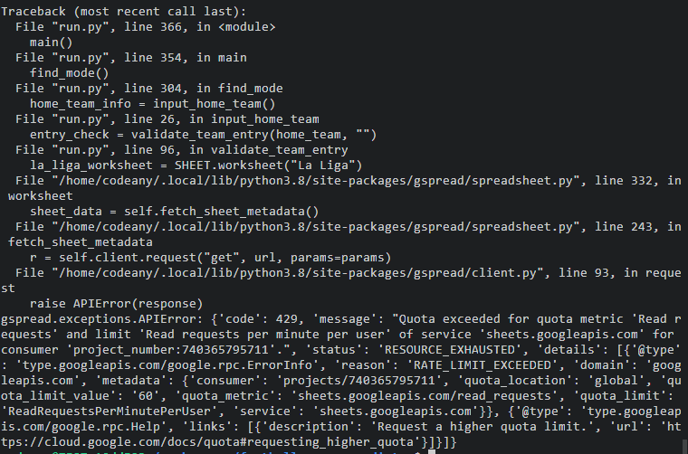

## Validator testing

- The python file passes through the [PP8 validator](link) with no issues except by the more than 79 characters per line recomended by PEP 8. 

# Technologies used

## Programming languages used

- Python 3

## Frameworks, Libraries & programs

- GitHub - to store my repository for submission.
- CodeAnywere - to creat my py file before pushing the project to Github.
- Heroku - by using the Code Institute template, I could deploy a web mock terminal where the program can run 
- gspread - to have a direct access to google sheets 
- google-auth - Google authentication credential to access Google APIs
- fuzzywuzzy - Python library used for string matching and string similarity
- NumPy - Python library used for scientific computing
- Am I responsive - to ensure the project looked good across all devices.

# Deployment

The program was deployed using Code Institue's mock termina for Heroku.

- Create a new Heroku app 
- Define the configuration vars: creds.json and PORT 
- Define the python and Node.js buildpacks
- Link the Heroku app with the GitHub repository
- Deploy the app

# Credits

## Data

- Data was collected from [FootyStats](https://footystats.org/)

## Code

- Love-sandwiches walkthorugh project provided by [Code Institute](https://codeinstitute.net/global/)
- Fuzzywuzzy library [Offical Python documentation](https://pypi.org/project/fuzzywuzzy/), and [use explanation](https://www.geeksforgeeks.org/fuzzywuzzy-python-library/)
- NumPy Library [Official NumPy](https://numpy.org/), and [stackoverflow](https://stackoverflow.com/questions/34968722/how-to-implement-the-softmax-function-in-python) to get the explanations of how to use the Softmax-like transformation.
- The .title() method [explanation](https://www.w3schools.com/python/ref_string_title.asp#:~:text=The%20title()%20method%20returns,be%20converted%20to%20upper%20case.)
- Function retruning more than 1 value [explanation](https://www.geeksforgeeks.org/g-fact-41-multiple-return-values-in-python/)
- List() method [explanation](https://www.programiz.com/python-programming/methods/built-in/list)