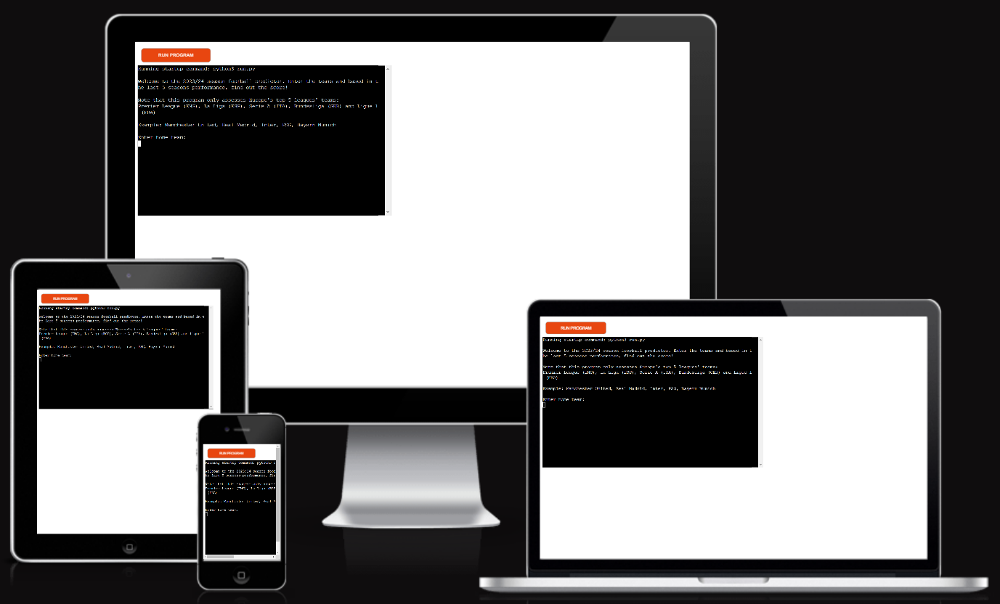
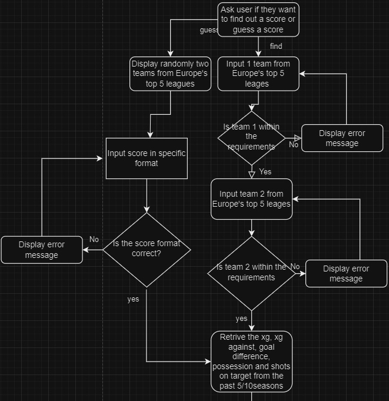
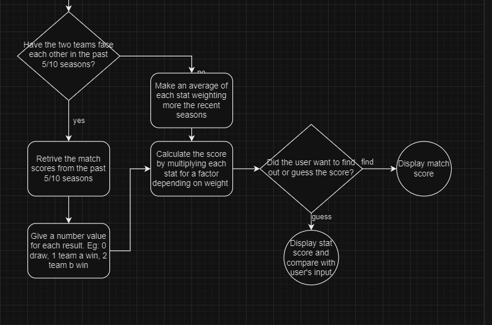

# Europe's football top 5 leagues 2023/24 predictor

This european football predictor is a python tool is designed to help users forecast match scores between two teams from the top European leagues. By analyzing their performance over the past five seasons, the tool generates accurate score predictions, offering valuable insights for football enthusiasts.

This project runs in the Code Institue mock terminal on Heroku.

This football predictor is live, to access it [click here.](https://football-score-predictor-a1ed8268ea3d.herokuapp.com/)

# Table of contents 
+ [How to use it](#how-to-use-it)
+ [Project Planning](#project-planning)
+ [Features](#features)
+ [Data Model](#data-model)
+ [Testing](#testing)
+ [Technologies used](#technologies-used)
+ [Deployment](#deployment)
+ [Credits](#credits)

# How to use it

This football predictor utilizes data from the top 5 European leagues spanning from the 2018/19 season to the 2022/23 season.

Upon launching the program, users are welcomed and provided with a concise explanation of its functionalities, as well as the leagues it can evaluate. 

The user has two choices, find out a score by inputing two teams or guess a score between two teams randomly displayed.

## Find out score mode

The program prompts the user to input the home and away teams. Leveraging their past season data and considering the home advantage, it calculates the likely match outcome. Home teams enjoy the "home" advantage, which is factored into the result prediction.

In scenarios where the user inputs a team name that does not precisely match the data spreadsheet, the program incorporates a percentage match feature. It then suggests a team based on this matching percentage and asks for user confirmation before proceeding further. This ensures accurate team selection and enhances the overall user experience.

If the user fails to provide an input with a match larger than 70%, the program will promptly provide feedback indicating that the input team is not part of Europe's top five leagues. Following that, it will request the user to re-enter the team name, ensuring compatibility with the supported leagues for accurate predictions.

## Guess score mode

In this mode, the program scans teams from the five European leagues and randomly selects two for users to guess the score of a match between them. Users must adhere to a specific format when entering scores (two numbers separated by a hyphen). If scores are not input in the correct format, an error message is displayed, prompting users to re-enter the input.

Upon correct input of the score, the program assesses the result based on calculations performed in the "find out score" mode. It then compares this result with the user's input and delivers feedback indicating the accuracy of the guess.

# Project planning

The purpose of the project is to process the data of the past 5 seasons of the european leagues and find out scores. The project features were defined by the following flow chart:

However, the process was break down into 4 stages: 

1. Begin by integrating data for a single league into the datasheet, ensuring the functionality of the "find out score" mode.
2. Once the initial mode is verified, extend the implementation to encompass the remaining four European leagues, while maintaining the effectiveness of the "find out score" mode.
3. Enhance the program by incorporating a team suggestion function, recognizing that football teams often have multiple recognized names.
4. Elevate the program's capabilities by introducing the "guess score" mode. This mode will present users with two randomly selected teams, prompt for precise user input, and subsequently compare the user's input against the calculated outcome.e 

The presented flowchart showcases a notable omission—the inclusion of the head-to-head results for incorporation into the score result calculation. To address this, an API connection is recommended for retrieving this dynamic statistic. This approach is favored due to the substantial volume of data involved. While each team competes in 38 league matches annually, additional engagements like regional and international cups further compound the dataset. Leveraging an API streamlines the retrieval process by accessing specialized databases, expediting requests that would otherwise be time-intensive when dealing with static data.

# Features

## Existing features
- Data retrival and processing
    * The program scans all 5 worksheets to identify or suggest a match based on user input
    * The program then uses the matches to retrive the specfiic statistics for the teams
    * It the process this data by calculating a weighted average of each team's statistics, which is then multiplied by a factor to determine the result
    * To account for the home advantage, it adds 1 goal for the home team and subtracts 1 goal from the away team.
    * To provide a realistic result, the program sets a maximum goal output of 5 goals. 

- Guessing score
    * The program scans all 5 worksheets and selects two random teams for the user to guess a score between them
    * The program is designed to access only one format of a match score, this is two integers separated with a hyphen e.g. 2-3, 4-1, 1-0. 
    * Then the program runs the same calculations and compares the inputted result with the calculated result and provides feedback to their user about their guess

- Team suggestion
    * In football, teams can be known by various names, including nicknames, acronyms, or simplified versions of their official names. For instance: 
        * Machester Untied, Man Untied, Man Utd
        * Paris-Saint-Germain, PSG
        * Tottenham Hotsput, Spurs, Tottenham
        * FC Barcelona, Barcelona, Barca
    * To address the variation in team names, I utilized the fuzzywuzzy fuzz method. This approach calculates the similarity between two strings, allowing for a more robust and flexible matching process.
    * By combining the fuzzywuzzy method with data_entry_validation, the program offers the best matching suggestion for the user's input. It then seeks user confirmation to ensure the intended team is accurately identified and considered for further processing.

## Future features

- Use API connection to retrive data from a specific database instead if using static data 
- When using an API connetion, a regression model can be used in conjuction of multiple statistics to arrive to a more accurate result

# Data model
For this project, I employed static data retrieved from [FootyStats](https://footystats.org/). The following statistics were utilized to process and calculate the match result:

- xG (expected goals/match)
- Possession percentage/match
- Shots per match/covertion ratio
- Goals scored/match
- xG against (expected goals conceded/match)
- Goals conceded/match
- Clean sheet percentage

## Data collection and manipulation

The data collection process involved organizing the statistics for each team into specific worksheets. The spreadsheet comprises 5 worksheets, each representing one of Europe's top 5 leagues.

It is important to note that European football leagues operate on a relegation/promotion basis. This means that teams ending a season in the bottom part of the table (typically the last three positions) get relegated to a lower division, while the winners of the lower division get promoted to the first division.

Due to this system, teams are constantly moving between divisions, resulting in discrepancies in statistics due to the different football level. To address this, the data was amended and corrected accordingly. For teams that played in lower divisions in the past five seasons, offensive statistics (such as xG, possession, shots, and goals) were reduced by 20%, while defensive statistics (like xG against and goals conceded) were increased by 20%. This adjustment ensures a fair comparison between teams playing at different levels of football.

## Data processing*

The program scans the spreadsheet to retrieve statistics for the user-inputted teams, calculating a weighted average by assigning higher importance to more recent seasons. This approach accounts for the dynamic nature of football teams, which can experience exponential growth or decline based on their performance.

To compute the weighted average, each statistic is multiplied by a corresponding factor. Specifically, the statistics from the 2022/23 season are multiplied by 5, those from 2021/22 by 4, and so on, until the 2018/19 season, which is multiplied by 1. The resulting values are then summed and divided by 15 (the sum of the weights) to derive the weighted average, offering a nuanced evaluation of the teams' overall performance.

After processing the weighted averages, these are multuply by a factor to provide a result. The factors used where: 

- xG * 0.5 
- Possession * 0.25
- Shots/conversion rate * 0.5
- Goals * 0.5
- xG against * -0.5 
- Goals conceded * -0.75
- Clean sheet percentage * -0.5

Additionally, home teams typically enjoy an advantage, benefiting from the majority of supporters and familiar conditions. Consequently, one goal was added to home teams.

To ensure more realistic predictions, a maximum limit of 5 goals was set, preventing results that exceeded this threshold. Similarly, to maintain realism, a minimum limit of 0 goals was applied to teams with extremely negative statistics, preventing them from obtaining negative scores. 

# Testing

I have tested the project by performing the following tests: 

- Passed the code throigh a PEP8 linter and confirm there are no problems
- Provide invalid inputs, such as numbers or strings that do not match or provide a realistic match for the teams in these leagues
- Tested in my local terminal and the Code Institute Heroku terminal

## Bugs 

Most of the coding challenges where located in the validate_team_entry() function. At the start of the project I wanted to focus on the features of providing an exact match and to be able to retrive and process the data and provide an accurate result. So I only needed to scan 1 workseet, transposed the data to check if there was an exact match, and then just retrive the data from the exact match. 

When the program was accuratly working, I needed to include now the scan of the ohter 4 leagues. This meant that I needed to not only needed to check if the team was in the list, but also in which league they played so I could scan the correct spreadsheet in the get_team_data() function. For this I initially created a new function called get_team_league(), where I define a directory where the keys where the league names and then values the league data, I then transposed the data of the values to get a single list of the teams per league. Then I just use another directory, with the same keys but the values now where the list of teams that played there, then was just only to scan each lists of each value, and when there was a match, retrive the key (league name), that would be used in get_team_data() to scan the correct spreadsheet. 

After this process, I realise that teh get_team_data() and the validate_team_entry() functins were doing similar things and had repetitive code, such as retrive the worksheet data. Therfore, I refactor both functions, where the validate_team_entry() wont only give a return of a boolean to let the program continue but it will also provide the league of the team to be able to scan it in the get_team_data() function. 

Finally, the hardest part, provide a team suggestion in case the user does not input an exact match of the team(s) they want to find out the score. This was definelty going to be part of the validate_team_entry() function as it needed to assess if there was a not an match, suggest one, make the user confirm, and then validate the entry. 

I then first define a suggest_team() function that takes the user input and a list with all the teams of the league. Then I used the fuzz method that measures the similarity between two strings by calculating the [Levenshtein distance](#definitions) between two  strings. The function will first scan a list with all the teams, check the similartiy ratio from the user's input, and then it will return the highest ratio and the best match they found int the list. 

This function was then called in the validate_team_entry(). For this I tried to use the exisiting leage_team dictionary but for a reason, it was throwing an error stating an issue with the lower() methods used in teh suggest_team() function. Threfore, to solve this, I just created a single list with all the teams in the validate_team_entry() function, and use it as an input for the suggest_team() function. 

## Remaining bugs

- There is a limitation of requests per minute that this program can assess. Threfore, if the user decides to use the program multiple times, eventually the program will display an error message stating that the program exceeded the limit of API requests. 

## Validator testing

- The python file passes through the [PP8 validator](link) with no issues

# Technologies used

## Programming languages used

- Python 3

## Frameworks, Libraries & programs

- GitHub - to store my repository for submission.
- CodeAnywere - to creat my py file before pushing the project to Github.
- Heroku - by using the Code Institute template, I could deploy a web mock terminal where the program can run 
- gspread - to have a direct access to google sheets 
- google-auth - Google authentication credential to access Google APIs
- fuzzywuzzy - Python library used for string matching and string similarity
- Am I responsive - to ensure the project looked good across all devices.

# Deployment

The program was deployed using Code Institue's mock termina for Heroku.

- Create a new Heroku app 
- Define the configuration vars: creds.json and PORT 
- Define the python and Node.js buildpacks
- Link the Heroku app with the GitHub repository
- Deploy the app

# Credits

## Data

- Data was collected from [FootyStats](https://footystats.org/)

## Code

- Love-sandwiches walkthorugh project provided by [Code Institute](https://codeinstitute.net/global/)
- Fuzzywuzzy library [Offical Python documentation](https://pypi.org/project/fuzzywuzzy/), and [use explanation](https://www.geeksforgeeks.org/fuzzywuzzy-python-library/)
- The .title() method [explanation](https://www.w3schools.com/python/ref_string_title.asp#:~:text=The%20title()%20method%20returns,be%20converted%20to%20upper%20case.)
- Function retruning more than 1 value [explanation](https://www.geeksforgeeks.org/g-fact-41-multiple-return-values-in-python/)
- List() method [explanation](https://www.programiz.com/python-programming/methods/built-in/list)